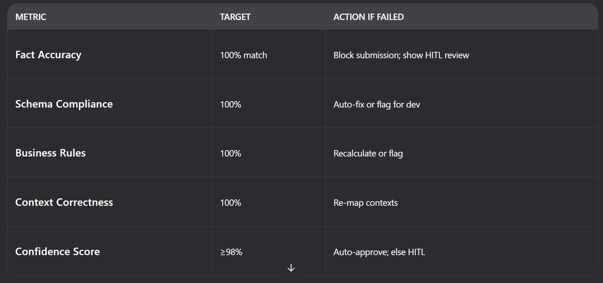

# 📄 XBRL AI — Project Blueprint (v3.0)
 
> ✅ **Goal**: Generate **100% SSM-compliant XBRL** + **human-readable Filing Report** from any MFRS/MPERS PDF  
> ✅ **Architecture**: Agentic, HITL-enabled, xAI-powered, Next.js + FastAPI

---

## 🎯 1. Ground Truth (Omesti Healthcare)

| Item | Value |
|------|-------|
| **Company Name** | Omesti Healthcare Sdn. Bhd. |
| **Registration No** | `202201041807` |
| **FYE** | `31 March 2024` |
| **Nature** | Separate, Audited, MFRS |
| **Currency** | MYR (Actuals) |

### ✅ Reference Files (For Validation)
- **PDF**: `uploads/OHealthcare-AFS-2024.pdf`
- **Excel**: `docs/FS-MFRS-OMESTI_HEALTHCARE_SDN._BHD-202201041807-31032024.xlsx`
- **XBRL**: `docs/SSM_FS-MFRS_202201041807_20240331 - Copy.xml.txt`
- **Filing Report**: `docs/Filing report generated by mbrsAI.pdf`

---

## 🧠 2. System Architecture (Agentic Design)

```mermaid
graph LR
  A[User Browser] -->|Upload PDF| B(Next.js Frontend)
  B -->|POST /api/ingest| C[Ingestion Agent]
  C --> D[Docling + PyMuPDF<br>(PDF → Structured Data)]
  D --> E[Mapping Agent<br>(SSM Taxonomy + xAI)]
  E --> F[HITL Agent<br>(Confidence <98% → Human Review)]
  F --> G[XBRL Generation Agent]
  G --> H[Filing Report Agent]
  H --> I[Download XBRL + Report]
  I --> J[LLM Evaluator<br>(Quality Gate: 100%)]


## 3. Agent	Responsibility
1. Ingestion Agent    - PDF parsing (Docling + PyMuPDF + Ollama fallback)
2. Mapping Agent      - Map PDF labels → SSM XBRL concepts (taxonomy-driven)
3. HITL Agent         - Flag low-confidence mappings for human review
4. XBRL Agent         - Generate valid XBRL instance with contexts/units
5. Filing Report Agent- Generate human-readable PDF report
6. Evaluator Agent    - Validate against gold standard + SSM rules

## 4. Project Structure (VS Code) 
xbrl-ai/
├── backend/
│   ├── venv/
│   ├── taxonomies/
│   │   └── SSMxT_2022v1.0/               # SSM taxonomy
│   ├── app/
│   │   ├── main.py                       # FastAPI entry
│   │   ├── agents/
│   │   │   ├── ingestion_agent.py        # PDF → structured data
│   │   │   ├── mapping_agent.py          # Label → XBRL concept
│   │   │   ├── hitl_agent.py             # Confidence scoring + human review
│   │   │   ├── xbrl_agent.py             # XBRL XML generation
│   │   │   ├── filing_report_agent.py    # Filing Report PDF
│   │   │   └── evaluator_agent.py        # Quality gate
│   │   └── models/
│   │       └── schemas.py                # Pydantic models
│   └── test_xbrl_generation.py           # End-to-end test
├── frontend/
│   ├── app/
│   │   ├── dashboard/                    # Upload + status UI
│   │   ├── mapping-review/               # HITL interface
│   │   └── results/                      # Download XBRL + Report
│   └── public/
│       └── sample-screens/               # UI mockups (to be added)
├── docs/
│   ├── FS-MFRS-OMESTI_HEALTHCARE_SDN._BHD-202201041807-31032024.xlsx
│   ├── SSM_FS-MFRS_202201041807_20240331 - Copy.xml.txt
│   └── Filing report generated by mbrsAI.pdf
├── uploads/
│   └── OHealthcare-AFS-2024.pdf
├── .gitignore
└── README.md


## 🔑 4. Critical Input Files for Qwen3-Coder
### Backend
- OHealthcare - AFS 2024.pdf → PDF to process
- SSMxT_2022v1.0/ → SSM taxonomy folder
- FS-MFRS-...xlsx → Mapping ground truth
- SSM_FS-MFRS_...xml.txt → XBRL reference
- Filing report generated by mbrsAI.pdf → Report reference
### Frontend
- UI mockups (to be provided later) for:
- Upload dashboard - upload and also list of uploaded load with status. And edit/view/download
- Mapping review screen - ability to view/edit with xAI + HITL 
- Results page - Preview in the form of the Filing Report + XBRL instance. Allow to download these files.

## 5. Sample UIs for the Frontend.


## 📊 6. Quality Gates (LLM Evaluator)


