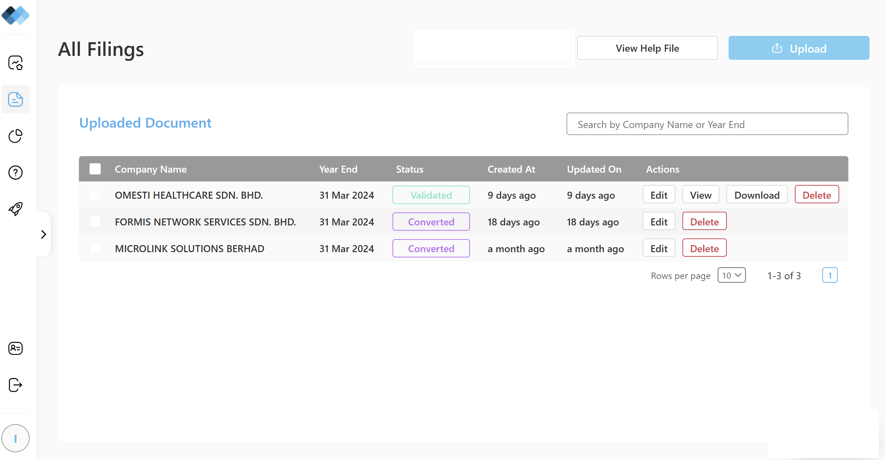

# Prompt 1: Ingestion Agent
Build `ingestion_agent.py` using Docling + PyMuPDF. Extract tables as markdown, text blocks as HTML. Support scanned PDFs via Tesseract OCR. Return structured data.

# Prompt 2: Mapping Agent
Build `mapping_agent.py` that maps PDF labels to SSM concepts using `lab_en-ssmt-fs-mfrs_2022-12-31.xml`. Use fuzzy matching (threshold=70). Return confidence scores.

# Prompt 3: XBRL Agent
Build `xbrl_agent.py` that generates valid XBRL XML matching `SSM_FS-MFRS_...xml.txt`. Use contexts `asof_20240331_SeparateMember` and units `MYR`. Include all required namespaces.

# Prompt 4: Filing Report Agent
Build `filing_report_agent.py` using `reportlab` to generate PDF matching `Filing report generated by mbrsAI.pdf`. Include company info, key financials, validation status.

# Prompt 5: Evaluator Agent
Build `evaluator_agent.py` that validates against Omesti ground truth. Check fact accuracy, schema compliance, business rules. Return quality score.

# Prompt 6: Next.js Frontend
Build a Next.js 14 (App Router) dashboard with:
- PDF upload. A list also showing previously upload page with status (uploading, in-progress, completed)

- HITL review screen (confidence <98%). The screen should be similar to the Filing Report displaying all the fields and values. In the review allow view/edit/validate with xAI: click value → show PDF page + highlight elements on page
- Preview and download XBRL + Filing Report


# 🛠️ 6. Execution Steps for the above prompts 

## Step 1: Set Up Environment
``` bash
# WSL2 Ubuntu 24.04
sudo apt install tesseract-ocr poppler-utils
curl -fsSL https://ollama.com/install.sh | sh
ollama pull llama3:8b
```

## Step 2: Run Backend
``` bash
cd backend
source venv/bin/activate
uvicorn app.main:app --reload --host 0.0.0.0 --port 8000
```

## Step 3: Run Frontend
``` bash
cd frontend
npm run dev
```

## Step 4: Test End-to-End
1. Upload OHealthcare - AFS 2024.pdf
2. Review mappings (HITL if confidence <98%)
3. Download XBRL + Filing Report
4. Verify against reference files


